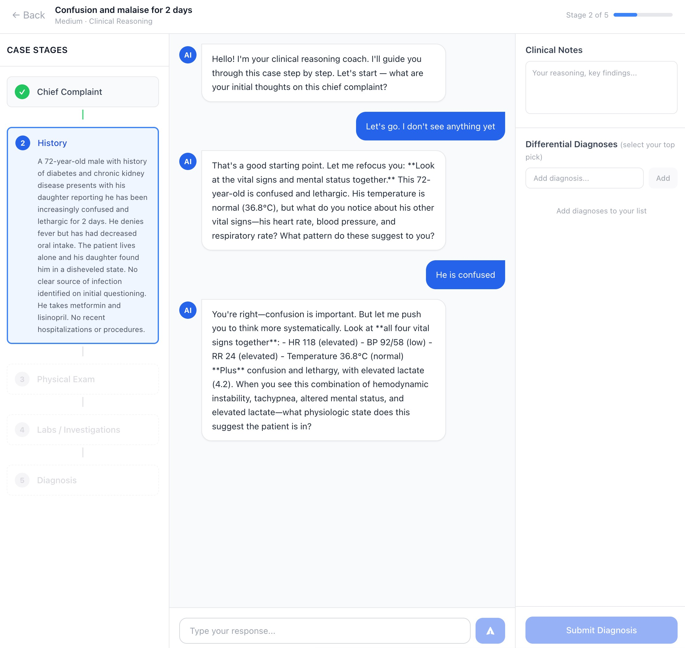

## Developing Ideas with GenAI: Vibe Coding & Spec-Driven Development

This is an example `prd.md` and `claude.md` for generating a project. You can copy the prompt from
`prompt.md` in Claude Code and then generate the application in Claude Code. The given prompt will
look up `prd.md` and `claude.md` and use them to generate a first application.

## Example screenshot of an app

